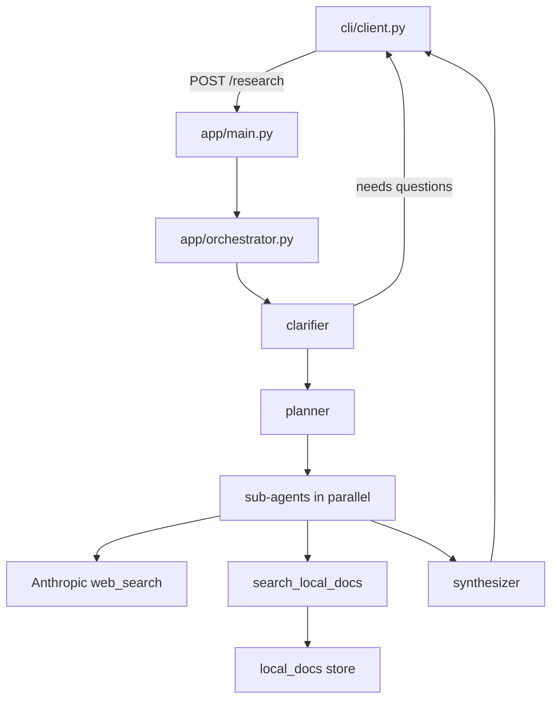

# Deep Research Agent

An API-based local research agent: You send it a question; it may ask a few clarifying questions, splits the question into sub-questions, researches each one against the web and files in `docs/`, then returns one structured recommendation with citations. 
CLI client included.

## Setup

### 1. Start the local embedding model

```bash
docker compose up -d
docker exec -it localdeepresearch-ollama-1 ollama pull nomic-embed-text
```

(Container name may differ — check with `docker ps` if the exec fails.)

### 2. Install Python dependencies

```bash
uv add anthropic fastapi "uvicorn[standard]" pydantic pdfplumber numpy requests python-dotenv click
uv sync
```

### 3. Configure

```bash
cp .env.example .env
# edit .env and set ANTHROPIC_API_KEY
```

### 4. Add your documents

Drop PDF/MD/JSON/TXT files into `./docs/` (or set `DOCS_DIR` in `.env` to
point elsewhere).

### 5. Run the API server

```bash
#  Document embedding — happens at API startup
uv run python -m app.main
```

This ingests/embeds your docs on startup (cached — only changed files are
re-embedded on subsequent runs) and serves on `http://localhost:8000`.

### 6. Run the CLI

In a separate terminal:

```bash
uv run python -m cli.client
# or: python -m cli.client -q "Should we migrate our data pipeline to X?"
```

Add `--save result.json` to also write the structured recommendation to disk.

## Endpoints

- `POST /research` — `{"question": "..."}` → clarification questions or final result
- `POST /reindex` — force a re-scan of the docs directory (e.g. after adding files without restarting)
- `GET /health` — chunk count / liveness check

## Notes

- Sub-agent iteration cap and model choices are in `app/config.py` — tune via `.env`.
- If you add many more documents later (hundreds+), revisit the in-memory
  store in `app/local_docs.py` — see the design spec §3 for the vector-DB
  upgrade path.

## How a request moves



### Test

```bash
# test the internal plumbing, good for confirming ingestion/retrieval
uv run python -m cli.client -q "What did Rigetti's latest earnings report say about revenue and cash position?"

# test the full pipeline (clarify → plan → parallel sub-agents → synthesize)
uv run python -m cli.client -q "Based on Rigetti's latest earnings report and current market sentiment, is this a good time to buy RGTI stock?"
```