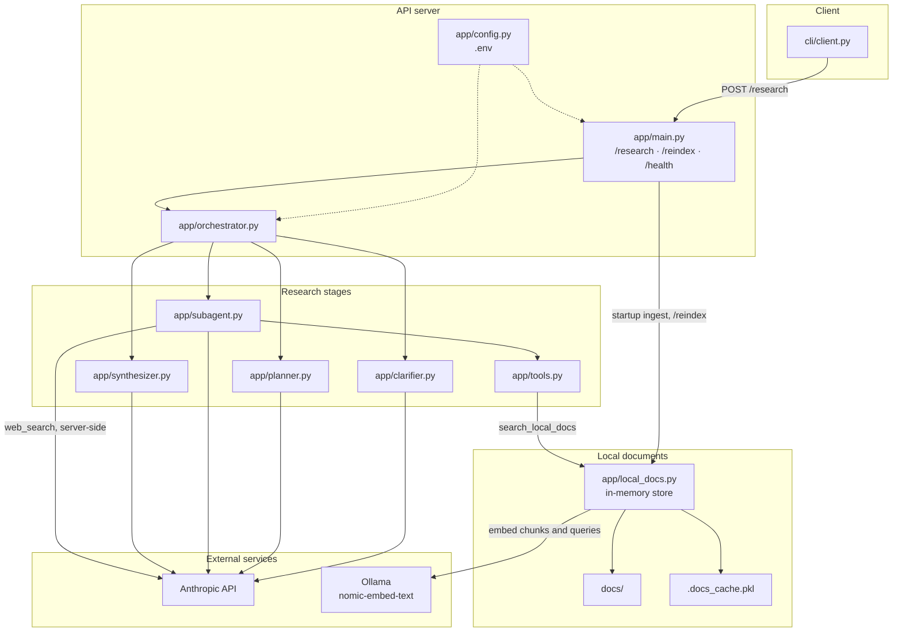

# Architecture

The solution is a local FastAPI process plus a CLI. Research is one pipeline inside that process: clarify, plan, research in parallel, then synthesize. Models run on the Anthropic API. Document embeddings run on a local Ollama container.

| Component | Role |
|---|---|
| `cli/client.py` | Sends the question, collects clarification answers, prints the recommendation. |
| `app/main.py` | HTTP API. Loads and ingests documents on startup. |
| `app/config.py` | Models, chunking, iteration cap, paths, and the API bind address. |
| `app/orchestrator.py` | Runs the four stages and fans sub-agents out in parallel. |
| `app/clarifier.py` | Decides whether the question needs up to three clarifying questions. |
| `app/planner.py` | Splits the question into sub-questions tagged `web`, `local_docs`, or both. |
| `app/subagent.py` | Bounded tool loop for one sub-question. |
| `app/synthesizer.py` | Turns findings into one structured recommendation. |
| `app/tools.py` | Anthropic tool schemas. Executes `search_local_docs` locally. Web search stays on Anthropic. |
| `app/local_docs.py` | Parses PDF/MD/TXT/JSON, chunks, embeds, caches, and cosine-searches in memory. |
